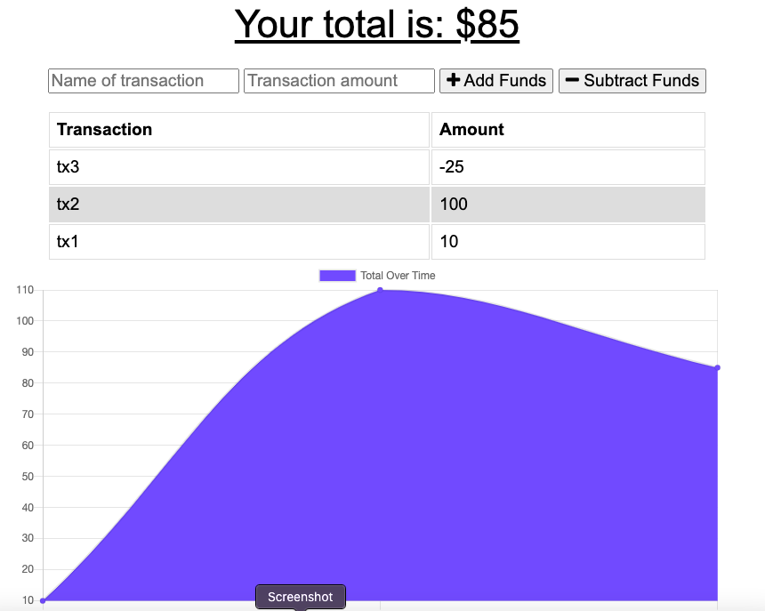

# Budget-Tracker-PWA
This aplication allows users to add expenses and deposits so they can keep track of their funds. This app is a Progressive Web Application which allows the users to use the app while not connected to internet or if they are on a slow connection without losing their functionality.

## Tools and languages used
1. Manifest.json to make a Progressive Web Application
2. InedexDB to kep track of database while offline
3. Service worker to keep track of cache files while offline
4. MongoDB Atlas to allow for deployment to Heroku and connection to database from the cloud

## How to use
[Click here to launch the application](https://shrouded-retreat-70146.herokuapp.com/) and start saving some money!!

